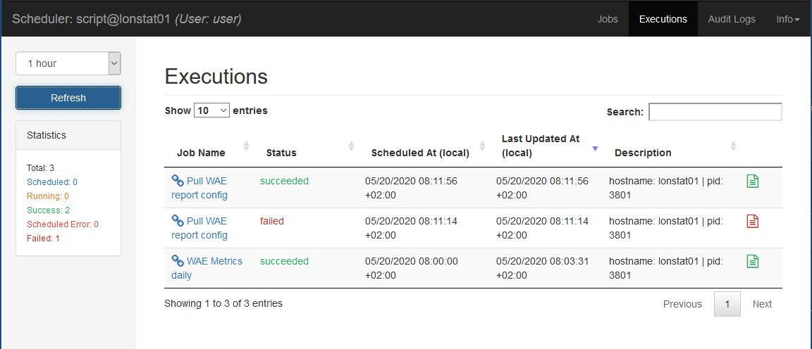
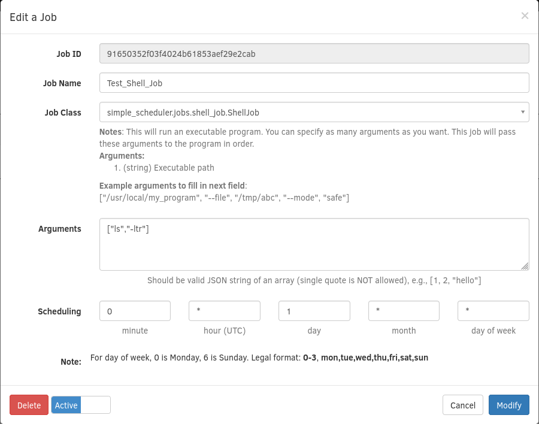

# Nextdoor Scheduler

[](LICENSE.txt)
[](https://travis-ci.com/palto42/ndscheduler)

``ndscheduler`` is a flexible python library for building your own cron-like system to schedule jobs, which is to run a tornado process to serve REST APIs and a web ui.

**Note:** It seems that the [original repository](https://github.com/Nextdoor/ndscheduler) of ndscheduler isn't maintained anymore. This fork has meanwhile significantly deviated from it and is not fully backwards compatible anymore.

**This version of ``ndscheduler`` supports Python 3 on Linux.**

## Table of contents
  
* [Key Abstractions](#key-abstractions)
* [Install ndscheduler](#install-ndscheduler)
  * [Setup](#setup)
* [Reference Implementation](#reference-implementation)
* [Contribute code to ndscheduler](#contribute-code-to-ndscheduler)
* [REST APIs](#rest-apis)
* [Web UI](#web-ui)

## Key Abstractions

* [CoreScheduler](https://github.com/Nextdoor/ndscheduler/tree/master/ndscheduler/corescheduler): encapsulates all core scheduling functionality, and consists of:
  * [Datastore](https://github.com/Nextdoor/ndscheduler/tree/master/ndscheduler/corescheduler/datastore): manages database connections and makes queries; could support Postgres, MySQL, and sqlite.
    * Job: represents a schedule job and decides how to run a particular job.
    * Execution: represents an instance of job execution.
    * AuditLog: logs when and who runs what job.
  * [ScheduleManager](https://github.com/Nextdoor/ndscheduler/blob/master/ndscheduler/corescheduler/scheduler_manager.py): access Datastore to manage jobs, i.e., schedule/modify/delete/pause/resume a job.
* [Server](https://github.com/Nextdoor/ndscheduler/tree/master/ndscheduler/server): a tornado server that runs ScheduleManager and provides REST APIs and serves UI.
* [Web UI](https://github.com/Nextdoor/ndscheduler/tree/master/ndscheduler/static): a single page HTML app; this is a default implementation.

Note: ``corescheduler`` can also be used independently within your own service if you use a different Tornado server / Web UI.

## Install ndscheduler

1. Create and activate Python venv under project folder
    * python -m venv .venv
    * source .venv/bin/activate
2. Install with pip
    * pip install -U pip wheel
    * pip install .
    * Install scheduler implementation like [simple_scheduler](https://github.com/palto42/simple_scheduler)
3. Configure ~/.config/ndscheduler/config.yaml
    * See [example configuration](config_example.yaml) and [default configuration](ndscheduler/config_default.yaml) for available options.
    * Optionally, enable authentication
      * For local authentication, configure users and passwords as in the [example configuration](config_example.yaml). Passwords must be hashed with bcrypt, which can be done with the command `python -m ndscheduler --encrypt`
      * For LDAP authentication, configure the LDAP server settings and the list of allowed users.
        * If LDAP authentication should be used, the Python package `python-ldap`must be installed.
4. Start scheduler implementation
5. Launch web browser at configured URL and authenticate with configured account

### HTTPS support

For https support the script requires the private public key pair.

A self signed certificate can be generated with the command:

```sh
openssl req -x509 -nodes -days 365 -newkey rsa:2048 -keyout ~/.ssl/private/script-selfsigned.key -out ~/.sslssl/certs/script-selfsigned.crt
```

### Setup

You have to implement three things for your scheduler, i.e., ``Settings``, ``Server``, and ``Jobs``.

#### Settings

In your implementation, you need to provide a settings file to override default settings.
This can either be done with a YAML file (recommended), or like in original version using a Python settings file.

If no configuration file is found, the [default settings](ndscheduler/config_default.yaml) will be used.

##### YAML config

The YAML config uses the [Confuse](https://confuse.readthedocs.io/en/latest/usage.html) library which searches for a configuration file in `~/.config/ndscheduler/config.yaml` (see [Confuse search paths](https://confuse.readthedocs.io/en/latest/usage.html#search-paths)).

All available settings can be found in [config_default.yaml](ndscheduler/config_default.yaml) file.

##### Python settings file

Create a Python settings file (e.g., [settings in simple_scheduler](simple_scheduler/settings.py))
and specify its path in the environment variable ``NDSCHEDULER_SETTINGS_MODULE`` before running the server.

All available settings can be found in [default_settings.py](ndscheduler/default_settings.py) file.

#### Server

You need to have a server file to import and run ``ndscheduler.server.server.SchedulerServer``.

#### Jobs

Each job should be a standalone class that is a subclass of ``ndscheduler.job.JobBase`` and put the main logic of the job in ``run()`` function.

After you set up ``Settings``, ``Server`` and ``Jobs``, you can run the whole thing like this:

```sh
NDSCHEDULER_SETTINGS_MODULE=simple_scheduler.settings \
PYTHONPATH=.:$(PYTHONPATH) \
    python simple_scheduler/scheduler.py
```

### Upgrading

It is best practice to backup your database before doing any upgrade. ndscheduler relies on [apscheduler](https://apscheduler.readthedocs.io/en/latest/) to serialize jobs to the database, and while it is usually backwards-compatible (i.e. jobs created with an older version of apscheduler will continue to work after upgrading apscheduler) this is not guaranteed, and it is known that downgrading apscheduler can cause issues. See [this PR comment](https://github.com/Nextdoor/ndscheduler/pull/54#issue-262152050) for more details.

## Reference Implementation

See code in the [simple_scheduler/](https://github.com/palto42/simple_scheduler) for inspiration :)

This reference implementation was originally included in the ndscheduler repository, but has been separated out in this fork.

## Contribute code to ndscheduler

### Install dependencies

```sh
# Each time we introduce a new dependency in setup.py, you have to run this
make install
```

### Run unit tests

```sh
    make test
```

### Clean everything and start from scratch

```sh
make clean
```

Finally, send pull request. Please make sure the [CI](https://travis-ci.org/palto42/ndscheduler) passes for your PR.

## REST APIs

Please see [README.md in ndscheduler/server/handlers](ndscheduler/server/handlers/README.md).

## Web UI

We provide a default implementation of web ui. You can replace the default web ui by overwriting these settings

```sh
STATIC_DIR_PATH = :static asset directory paths:
TEMPLATE_DIR_PATH = :template directory path:
APP_INDEX_PAGE = :the file name of the single page app's html:
```

### The default web ui

#### Login


#### List of jobs


#### List of executions



#### Audit Logs


#### Modify a job


